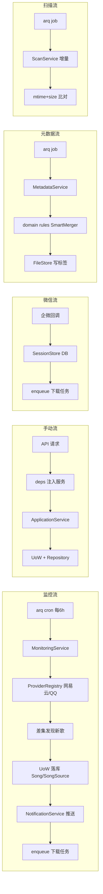

# 架构重构路线（一次性重建）

> 状态：已确认决策，待执行
> 日期：2026-08-12
> 范围：后端 + 前端 + 部署全栈重构
> 方式：**一次性重建**（非渐进式/Strangler），重建期间服务可长期不可用，本地开发验证即可

---

## 0. 决策记录（已与用户确认）

| # | 决策项 | 结论 | 影响 |
|---|--------|------|------|
| D1 | 数据库 | **保持 SQLite**（PostgreSQL 已否决） | 无迁移负担，单文件备份 |
| D2 | 任务队列 | **内置 Redis（同容器）+ arq**，不新增 docker 容器 | 镜像 +~15MB，内存 ~20MB |
| D3 | 进程管理 | **supervisord** 管理 redis-server + uvicorn + arq worker 三进程 | 单容器多进程，需进程监督 |
| D4 | 历史数据 | **全部可丢弃，重新扫描** | 无需写数据迁移脚本，Alembic 开全新基线 |
| D5 | 重构方式 | **一次性重建** | 放弃 Strangler 渐进式，按层切分阶段 |
| D6 | 重建期可用性 | 可长期不可用，本地开发验证 | 阶段不必每步可运行 |
| D7 | 内部 API | **不兼容旧路径**，前后端一起改 | 可删双路径、统一分页 |
| D8 | 对外契约（必须不变） | 微信回调路径、容器端口 18000、卷路径 `/config` `/audio_cache` `/favorites` `/library` | 部署与外部系统配置不动 |
| D9 | 对外契约（可改） | 签名试听链接格式（历史卡片失效可接受） | 通知卡片签名逻辑可重写 |
| D10 | 前端范围 | 清理死组件 + 重构状态管理与组件分层，**不重做 UI** | 保留现有视觉 |
| D11 | 文档落位 | `需求/核心方案归档/架构重构路线.md`（本文件） | 单文件 |

---

## 1. 项目现状与规模定位

**本质**：监控网易云/QQ音乐歌手新歌 → 自动下载 → 企业微信/Telegram 通知 → Web UI 播放收藏。**单用户 NAS Docker 部署**。

**技术栈**：
- 后端：Python 3.11 / FastAPI / SQLAlchemy 2.0 async / aiosqlite / APScheduler / Alembic
- 前端：Vue3 + Vite + Pinia + TypeScript + hash router
- 外部：GDStudio(下载) / pyncm / qqmusic-api-python / wechatpy / mutagen / opencc

**部署现状**：
- `docker-compose.yml`（19 行）：单 service，4 个卷，SQLite DATABASE_URL，PUID/PGID，`18000:8000`
- `Dockerfile`：两阶段（node:22-alpine 构建前端 → python:3.11-slim + ffmpeg + gosu），`ENTRYPOINT scripts/entrypoint.sh`，`CMD python main.py`（单进程无 worker）

**规模判断**：单用户、单容器、数据量小（个人曲库）。所有方案必须与这个规模相称——**不引入为多租户/高并发设计的复杂度**。

---

## 2. 九大根因（含文件级证据）

> 这些是重构要消灭的"为什么写下去就没跑过"的根源。第 2.1 节是它们直接造成的**必然失败端点清单**。

### R1 事务边界无主
- `app/repositories/base.py`：create/update/delete 每个方法自带 `await commit()`；`song.py::toggle_favorite` 也 commit
- 服务层（media_service/scan_service/artist_refresh_service）也各自 commit
- `文档/后端服务架构说明.md` 第 69 行声明"外部管理 Session 生命周期"——**三方争夺同一事务**
- 后果：`tests/conftest.py` 必须用 SAVEPOINT + `join_transaction_mode="create_savepoint"` 才能隔离，注释里明确写了"单跑绿、全量跑红的幽灵失败"

### R2 异常被系统性吞掉
- `app/utils/error_handler.py::handle_service_errors` 捕获后返回 fallback 降级值
- `MM_STRICT_ERRORS` 环境变量（`[Fix C-03]`）存在的唯一目的：让 CI 看见"被降级掩盖的 NameError 等真实缺陷"——**这是自证**
- 路由层 **23 处** `except Exception → HTTPException(500, str(e))`（8 个文件），把内部异常文本直接回显（信息泄露 + 无错误码）
- 全项目只有 **2 个** `response_model`（都在 settings.py），其余端点返回裸 dict

### R3 状态全在单进程内存
- `TaskMonitor.tasks / _pause_events / _cancel_flags`（`__new__` 单例）
- `AutoDownloadService.add_to_queue` → 裸 `asyncio.create_task`
- `core/websocket.py::ConnectionManager.active_connections`
- `core/logger.py::api_log_handler` 内存日志环
- `app/routers/wechat.py` 用户回复序号 → `asyncio.create_task(background_download)`
- 后果：重启丢任务、无重试、无法多 worker、`/api/tasks/{id}/pause` 在多进程下随机失效

### R4 配置三套并存 + 全局可变 dict
- `core/config.py`（Legacy，模块级 `config = {}`）被 6 个模块 `from core.config import config` 直接导入
- `core/config_manager.py`（4 层合并 defaults→env→YAML→DB SystemSettings，`_load_from_db` 里**每次调用另开同步 engine**，无缓存无 dispose）
- `core/config_migration.py`（YAML 模板迁移）
- 症状：`scheduling.py::get_release_interval_minutes` 4 级回退链；`routers/system.py` 与 `routers/settings.py` 同时提供 `/api/settings`（POST 全量写 YAML vs PATCH 增量写 DB，目标不同）
- 前端两套并用：`api/system.ts` 用 PATCH，而 `SettingsModalV2.vue`/`SettingsModal.vue`/`StorageSettings.vue` 直接 `axios.post('/api/settings')`
- 凭据脱敏靠 `[Fix C-01]` 在两处 `sanitize_config(manager._config)` 补丁

### R5 数据模型双轨
- `Song`/`SongSource`（新）与 `MediaRecord`（旧）并存；`MediaRecord` 仍被 `history_service.py`、`wechat_download_service.py`、`routers/media.py` 使用 → **微信下载与 Web 下载写入不同表**
- `app/models/metadata.py` 的 `Album`/`Lyric`/`SongMetadataCache` **零引用**（无任何 import），且未在 `app/models/__init__.py` 注册 → **表都不会建**
- `app/domain/models.py` 的 `MediaInfo` 仅被 `app/notifiers/*` 用；`notification.py` 靠 duck typing 兼容 MediaInfo/Song/MediaRecord 三种对象 → 契约名存实亡
- `SystemSettings` 6 个 JSON blob 列无 schema 校验；`settings.py::merge_section` 只做浅层 `dict.update`
- ORM 里塞 API 形状：`Song.local_files` / `Song.available_sources`

### R6 无存储抽象
- `MediaService.get_audio_path` 6 候选路径启发式修复（Win→Docker 迁移遗留）
- `main.py`：`UPLOAD_DIR = "/config/uploads" if CONFIG_FILE_PATH.startswith("/config") else "uploads"`
- `core/config.py::_detect_config_path` 与 `config_manager.py::_detect_config_path` 各一套 `os.path.exists` 级联
- `routers/media.py::_get_allowed_media_roots` + `_is_path_contained`（`[Fix C-02]` 目录穿越修复）在路由层做存储安全
- `app/utils/cache.py::DiskCache` 无容量上限、无淘汰，只有 7 天 TTL

### R7 依赖方向倒置 + 无 DI
- `_singletons.py` 4 个全局 getter，与 `TaskMonitor.__new__`、`AutoDownloadService.__new__` 两种单例风格并存
- `AutoDownloadService.__init__` 直接 `DownloadService()` / `MediaService()` → **复制 `RateLimiter`(45 token/300s)，GDStudio 限流失效**
- `app/services/*` 有 **87 处**函数内 `import`（规避循环依赖），`media_service.py` 单文件 15 处
- `aggregator.providers[1]` / `[0]` 按下标取 provider（`artist_refresh_service.py`），有 `get_provider(name)` 却不用
- `app/services/library.py` 是纯 Facade（12 个方法全转发），但 `routers/library.py` 15 个端点直接 new `ScanService()`/`MetadataHealer()`/`SongRepository` → **Facade 已死**
- `routers/system.py` 第 188/250 行 `from notifiers.telegram import` 路径错误（应 `app.notifiers.telegram`）→ Telegram 测试端点必然 500

### R8 性能与正确性隐患
- `ArtistRefreshService.refresh` 第 2 步对**每次单个歌手刷新**执行 `scan_local_files(db)` 全库扫描
- `_heal_all_metadata` 用 `Semaphore(5)` 并发，但每个 worker 让 `heal_song` **自开 `AsyncSessionLocal`**（注释承认是为避开 MissingGreenlet）→ 脱离外层事务边界
- `media_service.py::auto_cache_recent_songs` 每 30 分钟跑，**只计数不缓存**（空转任务）
- `core/database.py::async_init_db` 同时执行 `Base.metadata.create_all` 与 `alembic upgrade head`；`init_db()` 用 ThreadPoolExecutor + 新事件循环桥接
- 双引擎并存（async + sync），`get_db()` 与 `get_async_session()` 两套依赖
- `MediaService.get_songs` 手工映射，`duration=0` 硬编码、`updated_at=created_at` 假数据
- `core/scheduler.py` 的 `DummyScheduler` 静默吞掉所有 add_job → APScheduler 缺失时任务全不跑也不报错

### R9 死代码与卫生问题
- `app/routers/download.py` 完整实现但 `main.py:249` 注释掉注册（附带争论注释 `# Redundant with media.py`）
- `routers/websocket.py` 与 `routers/system.py` **重复注册同一个 `/ws/progress`**（两者都 include）
- `routers/subscription.py` 装饰器叠加双路径（`/api/artists` + `/api/subscription/artists`）
- `core/event_bus.py` 仅被 `system.py` 测试端点使用（构造 mock `MediaRecord` 发布 NEW_CONTENT）
- 前端孤儿组件：`SettingsModal.vue`、`components/settings/SettingsModalV2.vue` + `sections/*`、`ProfileModal.vue`、`RepairModal.vue`、`TaskCenter.vue` 均无引用；`RepairModal.vue` 调的 `/api/search_songs`、`/api/repair_audio` 后端不存在
- `web/src/views/`（LyricsView/MobilePlay）与 `desktop/views/` 并存；`/profile` 指向 Settings.vue（注释"暂时"）
- `pyproject.toml` 声明 `bilibili-api-python`、`loguru` 未用；`requires-python >=3.10` vs README/Dockerfile 的 3.11
- `config/` 提交了 `config.yaml.bak` 与 2 个 `music_monitor.db.bak.*`
- `scripts/` 30+ 一次性调试脚本；根目录游离 `test_api.py`
- 测试：`tests/` 仅 8 文件全在 test_services；`测试/后端/` 另有一套中文目录测试（不在 pytest testpaths 内 → **永不执行**）
- 生产代码里遍布 `[Fix C-01]/[Fix C-02]/[Fix C-03]` 审查整改注释

### 2.1 必然失败端点清单（R1/R2 的直接后果）

这些端点"写下去就没跑过"，而没被发现的原因正是 R1/R2（错误被吞、无契约测试）：

| 端点 | 症状 | 根因 |
|------|------|------|
| `/api/system/scan` | AttributeError → 500 | 调 `LibraryService.scan_local_files()` / `.enrich_metadata()`，方法不存在 |
| `/api/test_notify/{channel}`（telegram 分支） | ImportError → 500 | `from notifiers.telegram import` 路径错（应 `app.notifiers.telegram`） |
| `/api/check_notify_status/{channel}` | ImportError → 500 | 同上 |
| `/api/test_notify_card/{channel}` | ImportError → 500 | `from core.database import MediaRecord`，类不在此 |
| `/api/check/{source}` | 恒 404 | `job_id = f"job_{source}"`，实际注册 id 为 `job_new_release_check` 等常量 |
| `RepairModal.vue` 调 `/api/search_songs`、`/api/repair_audio` | 404 | 后端不存在 |
| `/api/tasks/{id}/pause` 等 | 多进程下随机失效 | TaskMonitor 全内存 |

---

## 3. 目标架构（4 层 + DI）

```
app/
├── api/            表现层：路由 + Pydantic 契约 + deps + 统一异常
│   ├── deps.py     session / current_user / config / uow
│   ├── errors.py   BaseError → 结构化响应，禁止回显 str(e)
│   └── v1/         auth artists songs discovery downloads metadata media settings system wechat ws
├── domain/         实体 + 纯业务规则（无框架依赖，可单测）
│   ├── entities.py Artist Song SongSource
│   ├── enums.py    SongStatus SourceName Quality
│   └── rules/      merging(SmartMerger) dedup matching
├── application/    用例编排（依赖注入，唯一事务边界）
│   ├── services/   artist song download metadata notification scan wechat
│   └── tasks/      arq worker + jobs（监控/下载/治愈/扫描）
├── infrastructure/
│   ├── db/         engine session UnitOfWork repositories(不 commit)
│   ├── providers/  netease qqmusic gdstudio（按 name 注册表）
│   ├── notifiers/  wecom telegram
│   ├── storage/    StoragePaths + FileStore + BoundedDiskCache
│   ├── config/     pydantic-settings（单一来源）
│   └── realtime/   WebSocket hub（Redis pubsub 支撑多进程）
├── container.py    自研轻量 DI
└── main.py         仅 create_app() 组装
```

**分层原则**：
- `domain` 不依赖任何框架/基础设施，纯 Python 可单测
- `application` 是唯一事务边界（UoW 提交点），依赖注入
- `infrastructure` 实现接口，可替换（provider/notifier/storage）
- `api` 只做参数校验与响应整形，不写业务逻辑

---

## 4. 模块划分（6 业务域）

| 域 | 职责 | 关键服务 |
|----|------|----------|
| 1. 订阅监控 | 歌手订阅、新歌发现、发布检查 | MonitoringService、SubscriptionService |
| 2. 媒体库 | 歌曲/歌手/专辑 CRUD、扫描、元数据 | SongService、ScanService、MetadataService |
| 3. 下载 | 下载编排、限流、重试、任务队列 | DownloadService、DownloadTask |
| 4. 通知 | 企业微信/Telegram 推送、卡片签名 | NotificationService、WecomNotifier、TelegramNotifier |
| 5. 播放 | 音频流、试听、收藏、历史 | MediaService、PlaybackService |
| 6. 系统 | 配置、任务管理、WebSocket、日志 | SettingsService、TaskService、RealtimeHub |

---

## 5. 业务流程（重构后）



**关键变化**：
- 所有后台任务走 arq（持久化 + 重试 + 超时），不再 `asyncio.create_task`
- 事务只在 application 层提交（UoW），Repository 不 commit
- 配置单一来源（pydantic-settings），删三套并存
- 单进程 WebSocket hub 保留（单用户场景够用），多 worker 时换 Redis pubsub

---

## 6. 实施阶段（一次性重建，按层切分）

> 因 D5/D6（一次性重建 + 可长期不可用），阶段按**依赖顺序**切分而非"每阶段可运行"。阶段 0 是唯一例外——它是安全网，先于一切。

### 阶段 0：安全网（先于一切，唯一保留渐进式的地方）✅ 已完成

**目的**：一次性重建更需要验收基线。先把"哪些是坏的"钉死，避免重建后无法区分新旧缺陷。

原定 5 项子任务，执行中**调整了顺序**：原计划先开 `MM_STRICT_ERRORS=1` 跑单测产出缺陷清单，实测 84 个用例全绿、零新缺陷——因为现有单测只覆盖 `deduplication` / `smart_merger` / `media_asset` / `scan_service` 等纯逻辑服务，根本触不到装了 `handle_service_errors` 的坏路径（那些在 routers 与 God service 里）。故改为先补冒烟测试，再据此产出缺陷清单。

1. **测试目录整理** ✅
   - `测试/后端/元数据补全/test_metadata_healing.py` → `tests/test_services/`（唯一有真实价值：测 `_should_skip_enrichment` / `_preprocess_search_keywords` / `get_best_match_metadata` 策略链）
   - `测试/后端/API连接/test_api_integration.py` → `tests/`
   - 根目录 `test_api.py` → `scripts/debug_artist_detail.py`（它是 `asyncio.run` + print 的调试脚本，却因 `test_*` 命名被 pytest 收集）
   - 待删（伪测试）：`测试/后端/验收测试/`（全程 mock 被测对象后断言 mock 自身返回值）、`测试/后端/性能测试/`（断言"内存<500MB / 百万次求和<5s"，测机器不测代码）、`测试/` 下 8 个 `.pyc`
2. **端到端冒烟测试** ✅ 新增 `tests/test_api_smoke.py`（23 例）
   - `smoke_client` fixture：`httpx.ASGITransport` 直连 app，**不走 lifespan**（避免 `scheduler.start()` 与真发企微上线通知），DB 依赖重定向到内存库
   - 12 个 GET 冒烟锁 + 设置脱敏回归锁 + 错误口令拒绝 + 微信回调签名校验
   - 9 个 `xfail(strict=True)` 固化已确认缺陷：修好后会变 XPASS 而**导致测试失败**，强制删标记，缺陷清单不会腐烂成文档
3. **真实缺陷清单** ✅ 见下方「阶段 0 产出：真实缺陷清单」
4. **静态检查** ✅ CI 原已有 ruff 双档门禁 + 覆盖率棘轮，本次增量补齐
   - `pyproject.toml` 加 `[tool.mypy]`：只开 `check_untyped_defs`，屏蔽 17 类噪音码，专抓 `attr-defined`
   - 新增 `.pre-commit-config.yaml`（通用文件检查 + ruff 致命错误）
   - `test.yml` 加非阻断 mypy step；覆盖率棘轮 20% → **30%**（实测 33.38%）
   - `requirements-dev.txt` 加 mypy / pre-commit
5. **卫生清理** ✅
   - `pyproject.toml`：`requires-python` `>=3.10`→`>=3.11`（对齐 Dockerfile）、删 `bilibili-api-python`（零引用）、修正失真的 description
   - 删两个伪测试：`验收测试/test_acceptance.py`（9 例全是 mock 掉被测对象后断言 mock 自身返回值）、`性能测试/test_performance.py`（断言"内存<500MB / 百万次求和<5s"，测机器不测代码）
   - 删 `config/` 下 3 个备份（1 个 `config.yaml.bak` + 2 个 `music_monitor.db.bak.*`）与 `测试/` 下 8 个 `.pyc`
   - `scripts/` 25 个一次性调试脚本 `git mv` 到 `scripts/_archive/`，原地只留 `entrypoint.sh`（Dockerfile 引用）与 `sync_version.py`（版本同步流程引用）
   - `.gitignore` 修正：原文件第 47 行 `cache/` 被误写成 UTF-16 字节，导致 `cache/` 规则从未生效（87 个 API 缓存 json 因此被跟踪）。重写为纯 UTF-8 并补 `logs/`、`*.bak*`、覆盖率与各类缓存产物；`git rm --cached` 停止跟踪 92 个运行时产物（磁盘文件保留）

**验收结果**：`113 passed, 9 xfailed`，覆盖率 33.38%，ruff 致命错误 0 命中，pre-commit 全绿。

---

### 阶段 0 产出：真实缺陷清单

在 `MM_STRICT_ERRORS=1` 下逐个探测端点得到的实测结果。这些是**重构 backlog 的输入**，每条都已被 `tests/test_api_smoke.py` 的 xfail 或断言锁住。

#### A 类：调用不存在的成员（上线即 500，mypy 已能全部拦住）

| 端点 | 实测 | 根因 |
|------|------|------|
| `GET /api/logs` | `AttributeError` | `system.py:97` 调 `api_log_handler.get_recent_logs()`，`APILogHandler` 只有 `buffer` 属性。**前端两个设置弹窗都在调它** |
| `POST /api/system/scan` | 500 | `LibraryService` 无 `scan_local_files` / `enrich_metadata`（Facade 拆分后遗留） |
| `POST /api/test_notify/telegram` | 500 | `No module named 'notifiers'`——`app/notifiers/` 存在但被 `sys.path` 遮蔽/包名写错 |
| `GET /api/check_notify_status/telegram` | 200 但 `connected:false` | 同上，被 `handle_service_errors` 降级成"正常返回错误态" |
| `POST /api/test_notify_card/telegram` | 500 | `cannot import name 'MediaRecord' from 'core.database'`（阶段 2 要退役的幽灵模型） |
| `POST /api/update_profile` | — | `config_manager.data` 不存在（正确名是 `_config`），mypy 报 3 处 |
| `POST /api/settings` | — | `ConfigManager` 无 `save_config`，`system.py:86` 直接调 |

#### B 类：路由契约错误

| 端点 | 实测 | 根因 |
|------|------|------|
| `POST /api/check/{source}` `POST /api/run_check/{source}` | 恒 404 `Job job_netease not found` | 端点拼 `job_{source}`，`scheduling.py` 实际注册的是 `job_new_release_check` / `job_file_integrity` / `job_auto_cache` / `job_asset_localize`。**按平台触发的能力从未存在过** |
| `GET /api/search_songs` `POST /api/repair_audio` | 200 HTML / 405 | `RepairModal.vue` 调的端点后端从未实现 |
| `GET /api/download_history/*` | 200 但返回 SPA HTML | 真实前缀是 `download-history`（连字符）。前端 `system.ts` 用对了，但**任何拼错的 `/api/*` 都会被 SPA catch-all 吞成 200 HTML**，404 永远不会暴露 |

> 最后一条是设计缺陷而非笔误：`@app.get("/{full_path:path}")` 无条件兜底，让所有 API 拼写错误静默变成"成功返回一段 HTML"。阶段 1 必须让 catch-all 排除 `/api/` 前缀。

#### C 类：状态在内存导致的假成功

| 端点 | 实测 | 根因 |
|------|------|------|
| `POST /api/tasks/{任意ID}/pause` `/cancel` | 恒 200 `{"status":"paused"}` | `task_monitor` 状态在单进程内存，不存在的 task_id 也照样返回成功（R3）。多进程下更是随机失效 |

#### D 类：mypy 暴露的其余真实缺陷（42 errors / 10 files）

- `core/event_bus.py` 9 处：`EventBus` 无 `_subscribers`——**整个事件总线是坏的**
- `app/notifiers/wecom.py` 3 处：`MediaInfo` 无 `trial_url`，企微卡片的试听链接永远取不到
- `app/services/notification.py` 2 处：`TelegramNotifier` 无 `send_message`（实际叫 `send_test_message`）
- `app/services/download_service.py` 11 处 `truthy-function`：`if progress_callback:` 判的是函数对象恒为真，**回调为 None 的分支从未生效**；另有 `DownloadService.retry_manager` 不存在
- `app/services/media_service.py:84`：对 `Result` 对象调 `.append()`
- `app/repositories/base.py` 4 处：泛型 `type[T]` 上访问 `.id`（阶段 1 引入 UoW 时一并处理）

### 阶段 1：地基（R1 R2 R4 R6）✅ 已完成

1. `infrastructure/config`：pydantic-settings 单一配置源。删 `core/config.py`、`core/config_migration.py`；`SystemSettings` JSON blob 加 Pydantic 校验
2. 统一 `/api/settings`：只留 PATCH（写 DB），删 `system.py` 的 POST；前端 3 处 `axios.post('/api/settings')` 改走 `api/system.ts`
3. `infrastructure/db`：单一 async engine + SQLite WAL + busy_timeout；删 sync engine 与 `get_db()`；删 `create_all` 只保留 Alembic（**新基线**，因 D4 无需迁移脚本）；移除 `init_db` 的线程+新循环 hack
4. 引入 `UnitOfWork`：Repository 全部去掉 commit，事务只在 application 层提交
5. `infrastructure/storage`：`StoragePaths` 统一路径解析；`get_audio_path` 的 6 候选启发式改为单一路径规则；`DiskCache` 加容量上限与 LRU 淘汰
6. `api/errors.py`：错误码枚举 + 结构化响应，禁止 `str(e)` 回显；去掉 `handle_service_errors` 的吞异常行为

**验收**：配置热更新（改设置→间隔重排生效）；Alembic 从空库 upgrade head 成功；无 create_all

### 阶段 2：领域 + 应用层（R5 R7 R8）✅ 已完成

1. `domain/entities.py` + `enums.py`；`Song.local_files`/`available_sources` 移到响应 schema
2. **MediaRecord 退役**（D4：数据全丢，无需迁移脚本）：`Song`/`SongSource` 为唯一事实源，`history_service`/`wechat_download_service`/`media.py` 全部切换
3. `Album`/`Lyric`/`SongMetadataCache` 确认零引用后删除（或真正接入）
4. 拆 `MediaService`（列表 / 音频路径 / 下载编排 三职责分离）；删 `app/services/library.py` Facade
5. `container.py` DI 容器；删 `_singletons.py` 与所有 `__new__` 单例；**修 `AutoDownloadService` 复制 RateLimiter 导致限流失效**
6. Provider 注册表按 name 解析，消除 `providers[0]/[1]`
7. 消除 87 处函数内 import（靠分层与 DI 打断循环依赖）
8. `ArtistRefreshService.refresh` 去掉全库扫描；`auto_cache_recent_songs` 空转任务删除或补实现
9. `heal_song` 不再自开 session，改由 UoW 传入

**验收**：MediaRecord→Song 切换后历史/微信下载记录数一致；限流单测（并发 60 次只放行 45）

### 阶段 3：任务队列 + 实时通道（R3）✅ 已完成

1. **内置 Redis（同容器）+ arq worker**（D2/D3）：
   - Dockerfile 装 `redis-server`（+~15MB）
   - Redis 配置：`unixsocket /tmp/redis.sock`（不开端口）+ `appendonly yes` + `dir /config/redis`（持久化到卷）
   - supervisord 管理三进程：redis-server / uvicorn / arq worker
   - `docker-compose.yml` **不新增容器**（D2）
2. 迁移：AutoDownload 队列、`heal_all`、ScanService、监控 cron、微信下载 → arq job（持久化 + 重试 + 超时）
3. 任务状态从 `TaskMonitor` 内存迁到 Redis/DB，`/api/tasks/{id}/{pause,resume,cancel}` 改为操作 arq job
4. WebSocket 广播改经 Redis pubsub（多进程就绪）；删重复的 `/ws/progress`（保留 `routers/websocket.py`）
5. `DummyScheduler` 静默降级改为启动即失败（fail fast）

**验收**：`docker compose restart` 后未完成任务续跑；两 worker 并行不重复下载

### 阶段 4：API 层（R2 R9）✅ 已完成

1. 按 `api/v1/` 重排 ✅（`app/routers/` → `app/api/v1/`，URL 不变；`system.py` 拆 5 文件：status/logs/scan/notify/misc；`media.py` 拆 4 文件：download/player/history/mobile；`app/api/__init__.py` 补建；main.py 注册更新；git 已重跟踪）；拆散 `system.py` 大杂烩与 `media.py` 混杂
2. 每个端点补 `response_model`；统一分页（删 skip/limit 兼容，D7）
3. 删 `app/routers/download.py`；`subscription.py` 双路径收敛（前端同步改，D7）
4. 修 `from notifiers.telegram import` → `app.notifiers.telegram`
5. `EventBus` 决策：真正用于通知解耦，或删除
6. 认证白名单从 main.py 硬编码改为路由级 `dependencies=[]` 声明
7. **对外契约保持**（D8）：微信回调路径、端口 18000、卷路径不变；签名试听链接格式可改（D9）

**验收**：OpenAPI schema 覆盖全部端点；契约测试

### 阶段 5：前端（D10：清理 + 分层，不重做 UI）

1. 删孤儿组件（确认无入口后）：`SettingsModal.vue`、`components/settings/SettingsModalV2.vue` + `sections/*`、`ProfileModal.vue`、`RepairModal.vue`、`TaskCenter.vue`
2. `views/` 合并进 `desktop/`（LyricsView / MobilePlay 归位）
3. 组件内散落的 `axios.get('/api/...')` 全部收敛到 `api/` 模块
4. `/profile` 要么实现，要么删路由
5. 补 TS 类型与阶段 4 的 response_model 对齐
6. 重构 7 个 Pinia store 分层（index/library/player/progress/settings/user/websocket）

**验收**：`npm run build` 无未使用告警；手动走通全部页面

### 阶段 6：部署收尾

1. Dockerfile：supervisord 三进程 + redis-server；多阶段瘦身；`requires-python` 对齐 3.11
2. docker-compose：健康检查；SQLite WAL 卷注意事项；`/config/redis` 持久化
3. CI：lint + typecheck + test + docker build
4. 更新 `文档/后端服务架构说明.md`：事务约定改为 UoW 语义

**验收**：`docker compose up` 全栈冒烟

---

## 7. 关键文件清单

**删除**：
- `core/config.py`、`core/config_migration.py`（R4）
- `app/services/library.py`（R7 Facade）
- `app/routers/download.py`（R9 死文件）
- `app/services/_singletons.py`（R7）
- `app/models/media_record.py`（R5，D4 直接删）
- `app/models/metadata.py`（R5，确认零引用后删）
- `core/scheduler.py` 的 `DummyScheduler`（R8）
- 前端孤儿组件 8+（R9）

**重写**：
- `main.py` → `app/main.py::create_app()`（R9 God file）
- `core/database.py` → `infrastructure/db/`（R8 双引擎 + create_all）
- `core/config.py`/`config_manager.py`/`config_migration.py` → `infrastructure/config/`（R4）
- `core/websocket.py` → `infrastructure/realtime/`（R3）

**拆分**：
- `app/services/media_service.py`（R8 God service）
- `app/routers/system.py`（R9 大杂烩）
- `app/routers/media.py`（R9 混杂）

**修 bug**：
- `app/routers/system.py:188,250` telegram import 路径（R7）
- `app/services/auto_download_service.py` RateLimiter 复制（R7）

---

## 8. 验证标准汇总

| 阶段 | 验证 |
|------|------|
| 0 | pytest 全绿 + `MM_STRICT_ERRORS=1` 缺陷清单产出 |
| 1 | 配置热更新生效；Alembic 从空库 upgrade head 成功；无 create_all |
| 2 | MediaRecord→Song 切换后记录数一致；限流单测（并发 60 只放行 45） |
| 3 | `docker compose restart` 后未完成任务续跑；两 worker 并行不重复下载 |
| 4 | OpenAPI schema 覆盖全部端点；契约测试 |
| 5 | `npm run build` 无未使用告警；手动走通全部页面 |
| 6 | `docker compose up` 全栈冒烟 |

---

## 9. 被否决项与理由

| 方案 | 否决理由 |
|------|----------|
| PostgreSQL | 单用户 NAS 场景 SQLite 足够，避免引入数据库服务依赖 |
| 新增 Redis 容器 | 用户明确"不多增加容器"；同容器内置 Redis 满足需求 |
| Strangler 渐进式重构 | 用户选择一次性重建；数据可丢弃使并存期无必要 |
| 数据迁移脚本 | 历史数据全部可丢弃，重新扫描即可 |
| 前端 UI 重做 | 用户选择清理 + 分层重构，保留现有视觉 |